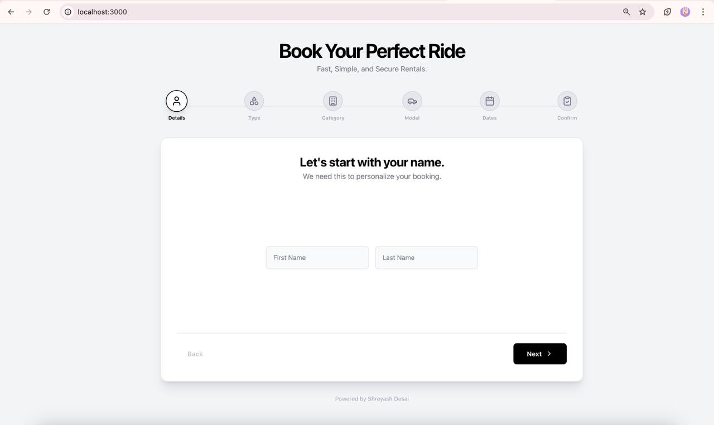
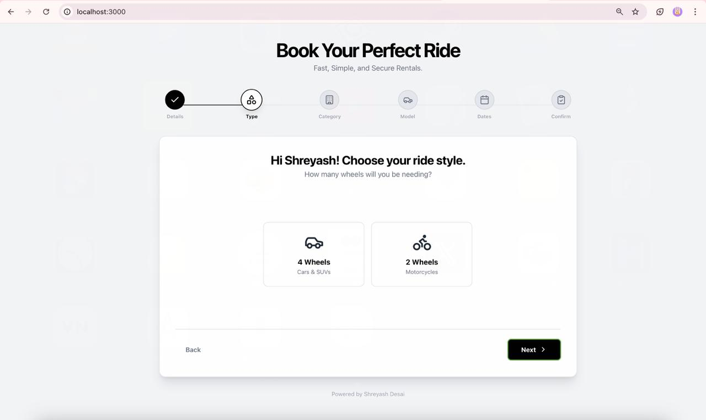
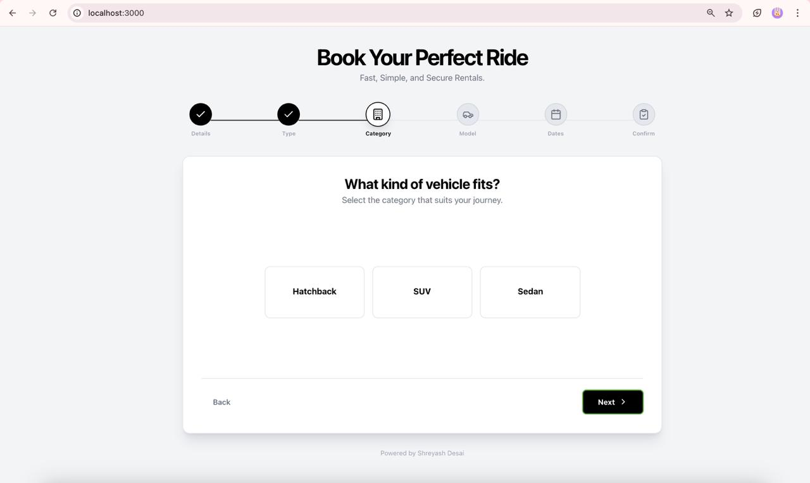
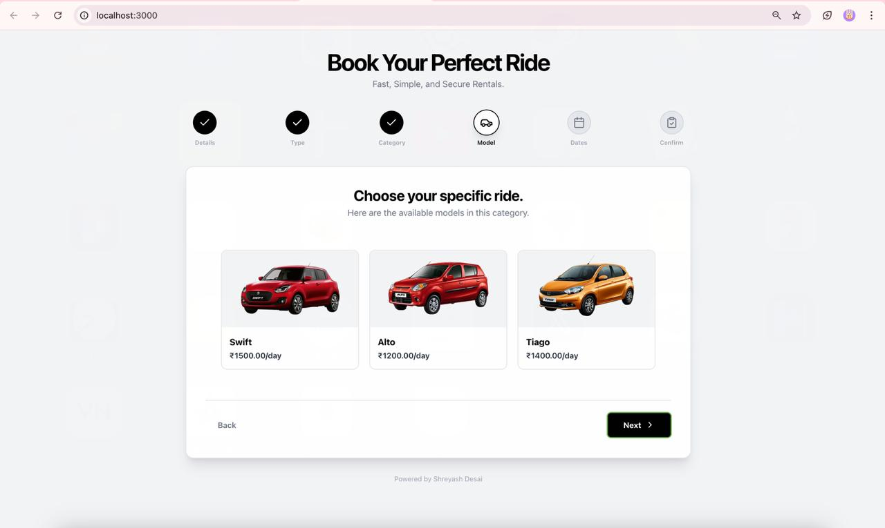
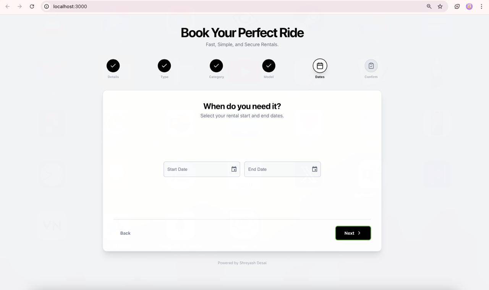
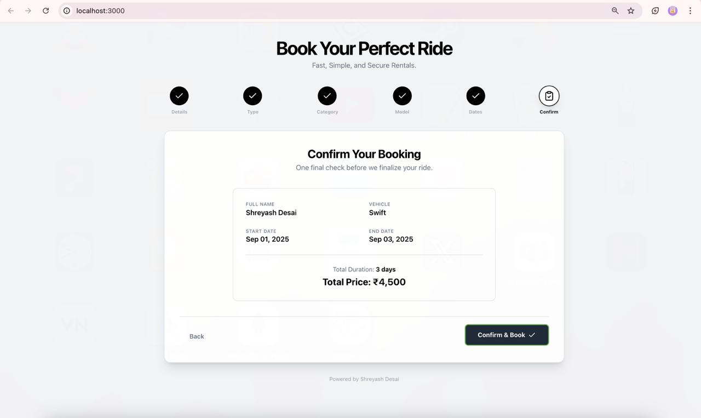
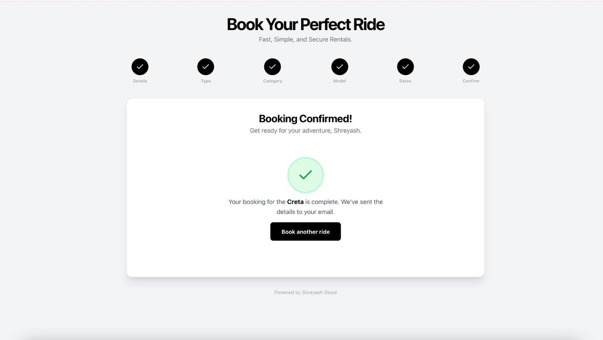
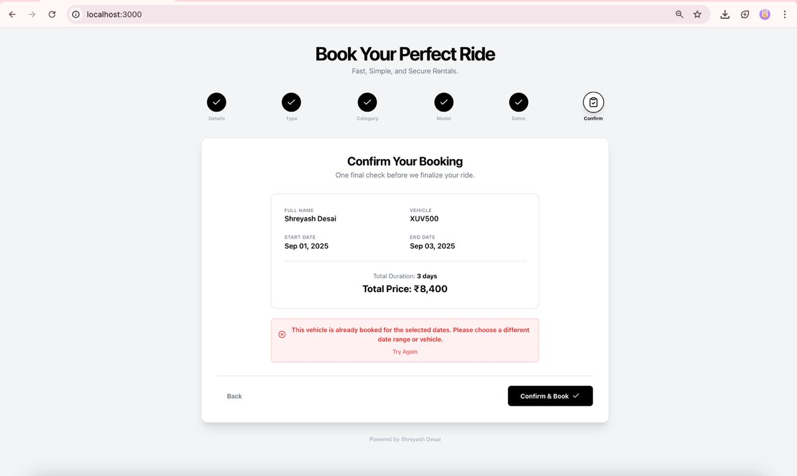

# 🚗 Vehicle Rental Booking System

A **full-stack web application** for renting vehicles (cars and bikes).  
Built with a **step-by-step booking flow**, real-time validations, and **backend integration** to ensure smooth and error-free vehicle rentals.  

---

## 📑 Table of Contents
- [✨ Features](#-features)
- [🛠 Tech Stack](#-tech-stack)
- [📸 Screenshots](#-screenshots)
- [🎥 Video Demo](#-video-demo)
- [⚙️ How to Run the Project](#️-how-to-run-the-project)
- [📂 Project Structure](#-project-structure)
- [🤝 Contributing](#-contributing)
- [📜 License](#-license)
- [👨‍💻 Author](#-author)

---

## ✨ Features  

- ✅ **Multi-step booking flow** (Name → Wheels → Vehicle Type → Model → Dates → Review → Submit)  
- 🔄 **Dynamic data fetching** from the database (no hardcoding)  
- 🛑 **Prevents double-booking** with date range validation  
- 🎨 **Modern UI** built with React + Material UI + TailwindCSS  
- ⚙️ **Backend powered by Node.js + Express + Sequelize ORM** (migrations + seeders)  
- 🗄 **SQL schema & seeds included** for easy setup  
- 📱 **Responsive design** that works seamlessly across devices  

---

## 🛠 Tech Stack  

  
  
  
  
  
  
  
  

---

## 📸 Screenshots  

### Step 1 – Enter Name  
  

### Step 2 – Select Number of Wheels  
  

### Step 3 – Choose Vehicle Type (fetched dynamically)  
  

### Step 4 – Select Specific Model  
  

### Step 5 – Pick Date Range  
  

### Step 6 – Review & Confirm Booking  
  

### Booking Confirmed - Confirmation
  


### Error Case – Double Booking Prevention  
(Example: Trying to book the same car again in overlapping dates)  
  

---

## 🎥 Video Demo  

The following video demonstrates the **entire booking flow**:  

- 🔹 Entering details step-by-step with live validations  
- 🔹 Error messages when required fields are left empty  
- 🔹 Successful booking confirmation  
- 🔹 Attempting to rebook the same vehicle → error shown  

👉 Watch the demo video

https://github.com/user-attachments/assets/59048db3-d241-4920-a712-4d649c9f55cd

▶️ Click the thumbnail above to view the full demo video.


---

## ⚙️ How to Run the Project  

1️⃣ **Clone the Repository**  
```bash
git clone https://github.com/<your-username>/<your-repo-name>.git
cd <your-repo-name>

2️⃣ Setup Backend

cd backend
npm install
npx sequelize db:migrate
npx sequelize db:seed:all
npm start

3️⃣ Setup Frontend

cd frontend
npm install
npm start


---

📂 Project Structure

backend/   → Node.js backend (server.js, config, migrations, models, seeders)
frontend/  → React frontend (App.jsx, index.js, Tailwind + Material UI setup)
database/  → Schema + seed SQL files
.gitignore → Ignore node_modules, build outputs, env files
README.md  → Project documentation


---

🤝 Contributing

Contributions, issues, and feature requests are welcome!


---

📜 License

This project is licensed under the MIT License.


---

👨‍💻 Author

Shreyash Pramod Desai

📫 Contact:

📧 Email: [your email]

💼 LinkedIn: [your LinkedIn]

💻 GitHub: [your GitHub]

